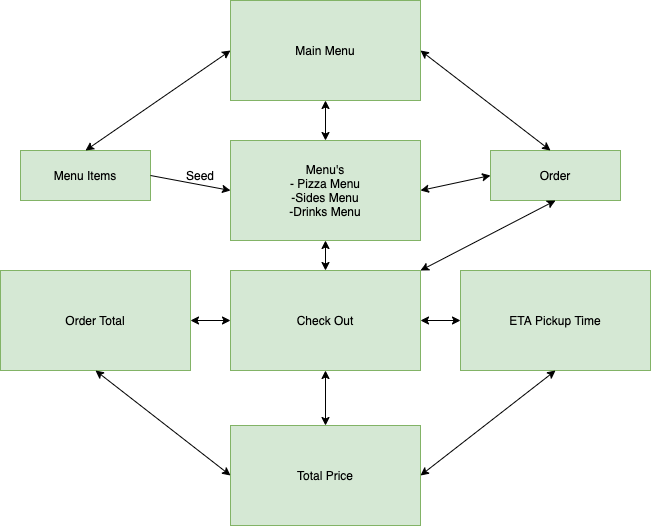

## CalvinDexter_T1A3
***
This project is to demonstrate knowledge and undersanding of Object Oriented Programming, the scope for the project is at least 3 features that are implementing ruby gems, classes, loops, methods, conditional control structures and error handling. 


***
## Installation
change directory to source folder:
```
cd src
```
run program by adding this to terminal:
```
./install.sh
```
***
## Dependencies
version of ruby used for this app:
```
ruby 3.0.2p107 (2021-07-07)
```
***
## Software Developmet Plan 

My Plan for this project is to design and build a pizza store where a user can place an order off a menu. Once selected a pizza or other menu item for their order the users choice will be added to a checkout. Once at the checkout user's will be given an order total and a real time ETA of the order to be ready for pick up from the store.  

The purpose of this app is to help a local pizza store recieve orders online to streamline their business operations. The user's of the app will be people from the local area who want to order a pizza in advance to being at the store. This should help the business to recieve more orders with the convenience of having an online presence.

### Scope :
The scope for the application and deliverables are as follows:
- User info, Name and Number
- 3 Menu's, Pizza's, Sides and Drinks
- User's Order 
- Checkout


The application will use DRY methods and have the menu items easy to add and remove from a develompers stand point. 

### Functions / Features :
- Display Menu's
- Add menu items to User's Order
- Place an order and get a pickup time
### Pseudocode :
```
user_info => name, number
menu_items => name, price
order_checkout => order_total, total_price, ETA_pickup_time
```
***

## Work Flow 

***
## Links
- [Github Repo](https://github.com/calvdext/CalvinDexter_T1A3)
- [Trello](https://trello.com/b/W4bT7wCQ/calvindextert1a3-terminal-application-project)